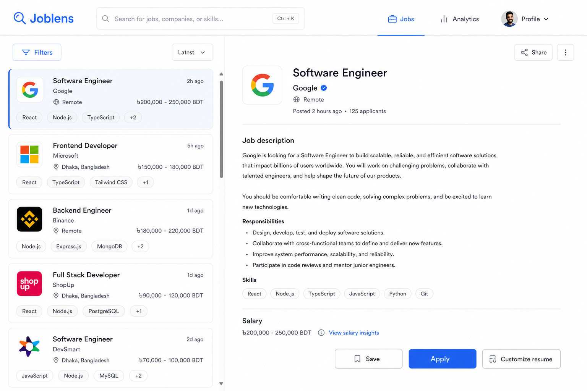

# Joblens Frontend

This is the **frontend** README (this folder only). Next.js UI for Joblens — Bangladesh developer jobs, live market stats, alerts, and AI resume tailoring.

Backend docs: `../ExpressBackend/README.md`

<p align="center">
  
</p>

<p align="center"><em>Landing — live count of active developer jobs</em></p>

<p align="center">
  
</p>

<p align="center"><em>Jobs board — list on the left, full posting on the right</em></p>

---

## What you get

- Public landing with a live job counter and ticker
- Jobs board (filters, search, similar jobs, detail)
- Analytics: skills, salaries, companies, Bangladesh map, demand
- Auth: register, login, verify email, password reset
- Signed-in: saved jobs, applied tracker, alerts, profile + match score
- Resume upload + **Customize resume** (AI PDF) on a job
- Admin dashboard (admin users only)

---

## Stack

Next.js 16 · React 19 · Tailwind · TanStack Query · Zustand · Axios · Socket.IO · React Hook Form + Zod

---

## Setup

**Need the API running first** at `http://localhost:4000` (see `../ExpressBackend/README.md`).

```bash
cp .env.example .env.local
npm install
npm run dev
```

Open [http://localhost:3000](http://localhost:3000).

### `.env.local`

```env
NEXT_PUBLIC_API_URL=http://localhost:4000/api/v1
NEXT_PUBLIC_SOCKET_URL=http://localhost:4000
NEXT_PUBLIC_USD_TO_BDT=120
NEXT_PUBLIC_APP_NAME=Joblens
```

On Vercel, set the same keys for Production, then redeploy. `NEXT_PUBLIC_*` is baked in at **build** time.

---

## Scripts

| Command | What it does |
| --- | --- |
| `npm run dev` | Dev server (webpack) |
| `npm run dev:turbo` | Dev server (Turbopack) |
| `npm run build` | Production build |
| `npm start` | Serve the build |
| `npm run lint` | ESLint |
| `npm run format` | Prettier |

---

## Pages

| Path | Access | What |
| --- | --- | --- |
| `/` | Public | Landing |
| `/jobs` | Public | Jobs board |
| `/jobs/[id]` | Public | Job detail |
| `/search` | Public | Search |
| `/analytics` | Public | Market charts |
| `/login` `/register` | Public | Auth |
| `/saved` `/jobs/applied` | Signed in | Lists |
| `/alerts` | Signed in | Job alerts |
| `/profile` | Signed in | Skills, resume, recommendations |
| `/admin` | Admin | Fetch logs, queues, trigger ingest |

---

## How it talks to the API

- REST via Axios (`src/lib/axios.ts`) — envelope `{ success, data, meta? }`
- Access token in memory; refresh uses the httpOnly cookie (`POST /auth/refresh`)
- Sockets: `job:new`, `stats:update` (`NEXT_PUBLIC_SOCKET_URL`)

If jobs do not load: API down, wrong `NEXT_PUBLIC_API_URL`, or CORS `FRONTEND_ORIGIN` on the API.

---

## Production

```bash
npm run build
npm start
```

Typical host: **Vercel**. Point `NEXT_PUBLIC_API_URL` at the public API (`…/api/v1`) and `NEXT_PUBLIC_SOCKET_URL` at the same API origin.

---

## License

Private / unpublished unless you add a license file.
